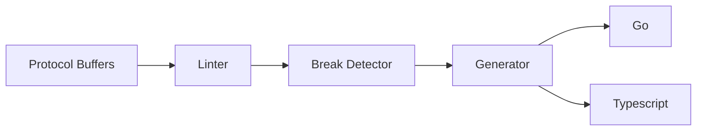

# JSON Model for Guance Cloud Console

**NOTICE: WORKING IN PROGRESS, DON'T USE IT IN PRODUCTION**

The purpose of this repository is to store the JSON model for the Guance Cloud Console.

## Introduction

JSON Model is inspired by [Grafana JSON Model](https://grafana.com/docs/grafana/latest/dashboards/build-dashboards/view-dashboard-json-model/) and implemented by Guance's technical stack.

It has the following advantages:

1. It is an SSOT (Single Source of Truth) for opening data structure.
2. It is easy to be version controlled.

### Language Support

There are some artifacts released:

| Name | Source Directory | Package Hosted | Description |
| ---- | ---------------- | --------------- | ----------- |
| Go | [/generated/go](./generated/go/) | `gomod` | Go package |
| Typescript | [/generated/ts](./generated/ts/) | `npm` | Typescript package |

### JSON Model

There are some JSON models in this repository:

| Name | Source Directory | Current Version |
| ---- | ---------------- | ----------- |
| Dashboard | [dashboard](./guance/io/json/dashboard/) | `v1alpha1` |
| Monitor | [monitor](./guance/io/json/monitor/) | `v1alpha1` |

## Implementation

We use the solution same as the [Open Metrics](https://github.com/OpenObservability/OpenMetrics) project of CNCF. And add our code generation pipeline. 

There are some features about it:

1. It is based on [Protocol Buffers](https://developers.google.com/protocol-buffers).
2. It can easily be compiled into other languages like Go, Typescript, etc.
3. It can detect and suspend the breaking changes of the JSON model.



Many organization has their contract management solution. [Kubernetes API](https://github.com/kubernetes/api/blob/master/core/v1/generated.proto) and [Buf Build](https://buf.build/) are excellent references.

## Contribution

If you want to add a new JSON model, create a new ProtoBuf file in the `guance/io/json` folder, and run the `make` script to manage SDLC (Software Development Life Cycle).

```shell
make gen  # generate code
make fmt  # format code
make lint # lint code
make test # run tests
```

This [Contribution Guidelines](https://guance.io/contribution-guide/) document contains more detailed information about contributing to this repository.

## License

This project is licensed under the Apache License 2.0. See the [LICENSE](./LICENSE) file for details.
