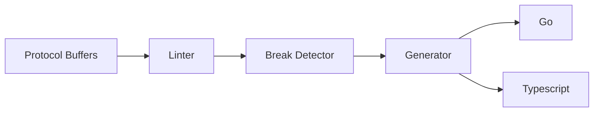

# JSON Model for Guance Cloud Console

This repository is used to store the JSON model for Guance Cloud Console.

## Introduction

JSON Model is inspired like [Grafana JSON Model](https://grafana.com/docs/grafana/latest/dashboards/build-dashboards/view-dashboard-json-model/). But Guance's.

It has the following advantages:

1. It is a SSOT (Single Source of Truth) for openning data structure.
2. It is easy to be version controlled.

### Language Support

There are some artifacts released:

| Name | Source Directory | Package Hosted | Description |
| ---- | ---------------- | --------------- | ----------- |
| Go | [/go](./go/) | `gomod` | Go package |
| Typescript | [/ts](./ts/) | `npm` | Typescript package |

### JSON Model

There are some JSON models in this repository:

| Name | Source Directory | Current Version |
| ---- | ---------------- | ----------- |
| Dashboard | [/proto/dashboard](./proto/dashboard/v1alpha1) | `v1alpha1` |
| Monitor | [/proto/monitor](./proto/monitor/v1alpha1) | `v1alpha1` |

## Implementation

We use the solution same as [Open Metrics](https://github.com/OpenObservability/OpenMetrics) project of CNCF. And add our own code generation pipeline. 

There are some features about it:

1. It is based on [Protocol Buffers](https://developers.google.com/protocol-buffers).
2. It is easy to be compiled into other languages, such as Go, Typescript, etc.
3. It can detect and suspend the breaking changes of JSON model.



Many organization has their own contract management solution, see [Kubernetes API](https://github.com/kubernetes/api/blob/master/core/v1/generated.proto), [Buf Build](https://buf.build/) for details.

## Contribution

In Guance Cloud, we use Go and TypeScript to build our product, so the JSON model will be compiled into Go and TypeScript package.

If you want add new JSON model, create a new protobuf file in `proto` folder, and run `make` script to manage SDLC (Software Development Life Cycle).

```shell
make gen  # generate code
make fmt  # format code
make lint # lint code
make test # run tests
```
